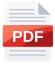

<p align="center">
  
  &nbsp;&nbsp;&nbsp;
  
</p>

<h1 align="center">Baca PDF</h1>

<p align="center">A small, quick PDF reader for Windows 11, with tabs, annotations, forms and signatures.</p>

Baca PDF opens your PDFs in tabs, lets you search and highlight, write notes on the pages, fill in forms and sign. It renders pages with PDFium and draws its own interface with Slint, so it feels like a Windows 11 app, has a touch layout for tablets, and stays light on memory. On a 138-page illustrated report it uses about 40 MB after opening, stays under 90 MB while scrolling from the first page to the last, and stays under 100 MB at 800% zoom.

## About the name

*Baca* is Indonesian for "read". It is the word you say when you tell someone to read something, and reading is the one thing this program is for, so the name says it directly. It is also short, easy to type and easy to remember. The "PDF" after it tells you what kind of files it reads.

## Why I asked AI to make it

I had it made for myself. I read a lot of PDFs, and I wanted a reader that opens fast, looks like it belongs on Windows 11, works well with a pen or a finger, and does not use much memory. This is a personal project, made for my own use, not a product.

It is 100% vibe coded with Claude Code. I am happy to share it, and you are welcome to fork it and change it to suit you.

<p align="center">
  Baca PDF is free. If it saves you some time and you feel like it, you can buy me a coffee:
  <br><br>
  <a href="https://ko-fi.com/zakkyhidayat"></a>
</p>

## What it does

### Reading

- **Tabs in the title bar**, next to Windows 11 style minimize, maximize and close buttons. Hovering maximize opens Snap Layouts. Each tab keeps its own zoom, page and rotation. Background tabs let go of their page images.
- **Pinned tabs**: right-click a tab and choose Pin tab. Pinned tabs sit first as icons only, cannot be closed by accident with the middle button, and come back pinned the next time you start.
- **Home** lists favorites, pages you bookmarked, and recent files with the page where you stopped. A right-click menu offers favorites, copy path, show in folder and remove. Middle click a file to open it in a background tab. A few settings sit on the right: theme, restore tabs, auto reload, default zoom, print size, the name written on annotations, and a button that opens Windows Settings to make Baca PDF the default for PDF files.
- **Zoom** from 25% to 800%: Automatic zoom, Actual size, Page fit, Page width, or a percentage, with Ctrl+plus, Ctrl+minus, Ctrl+wheel or a two-finger pinch. **Zoom to area**: pick it in View options (or hold Ctrl and drag), then drag a rectangle on the page.
- **View options**: scrolling (vertical, horizontal, wrapped, one page at a time), pages (single, two pages, book view), page color (normal, dark, sepia) and a touch layout.
- **Auto-scroll**: turn it on in View options or with Ctrl+Shift+A (it switches the view to vertical scrolling and single pages, and says so). The page moves down by itself; a small bar at the bottom changes the speed (eight steps) or stops it, and Esc stops it too. It stops by itself at the end of the document.
- **Find** (Ctrl+F): a bar under the toolbar with the match count, previous, next and close. Every match is highlighted, and accented letters match their plain forms.
- **Select and copy** text across pages, with Ctrl+C or the Copy bar. Ctrl+A selects the current page. Double-click selects a word, triple-click a line.
- **Links** inside the PDF: web and mail addresses open in your browser, page links jump there. Alt+Left and Alt+Right, or the side buttons of a mouse, go back and forward.
- **Side panel** with thumbnails, the document outline, bookmarked pages and the list of annotations. Drag its edge to resize it.
- **Page bookmarks** with a ribbon on the page and its thumbnail, a list on Home, and Ctrl+B.
- **Password-protected files** ask for the password.
- **Document properties** (Alt+Enter), **Print** (Ctrl+P, through the Windows print dialog, fit to the paper or at actual size) and **full screen** (F11), where the tab bar slides down when the pointer touches the top edge, with minimize and exit full screen.
- **Open files** by dropping them on the window, with Ctrl+O (the dialog starts in the folder of the last file), or from Explorer. The program lists itself under Open with for PDF files.
- **One window**: opening several PDFs from Explorer, or launching the program again, sends the files to the window that is already open as tabs.
- **Auto reload** when a file changes on disk, and **restore tabs** at start, both optional.
- **Light and dark theme**, following Windows unless you choose one on Home.
- **Touch**: larger targets, pinch zoom, double-tap to zoom, and drag to scroll. The layout switches on by itself on a touch screen.
- Keyboard shortcuts are listed in the app (F1).

### Annotating

- **Highlight, underline and strike through** selected text (five colors), **draw** freehand or as a rectangle, ellipse, line or arrow (five colors, three thicknesses), and **erase**. Highlight and Draw keep their options in one box under the toolbar while the tool is on.
- **Add here** (right-click a page): a **note** (a speech-bubble icon), **text** (several lines, a size and one of five colors, letters beyond Western ones too), an **image** (PNG or JPG) or a **signature** (type a name in a handwriting style and ink, or draw it with the mouse, a pen or a finger; the last drawn signatures are kept and can be placed again).
- **Pick an annotation** with a click. Drag to move it, pull a corner to resize it, press Delete or use the trash icon to remove it. Notes and added text have a pencil icon that opens one field to type the text again; for added text the same box also changes its size and color.
- **Annotations tab** in the side panel lists everything added, with who made it and when. Click one to jump to it, remove it from there, or click the dot of a highlight to change its color.
- **Undo and redo** (Ctrl+Z, Ctrl+Y or Ctrl+Shift+Z, and two buttons above the list in the Annotations tab) for adding, moving, resizing, retyping, recoloring and removing annotations. An annotation that was already in the file can be moved or retyped, but not brought back once removed. Saving into the file starts the undo history over.
- **Saving**: changes live in memory and show as a dot on the tab. Save (Ctrl+S) writes them into the file itself and keeps the file as it was before your first save as "name (backup).pdf" and as it was before the latest save as "name (previous).pdf". Save a copy (Ctrl+Shift+S) writes a new PDF. Save a flattened copy draws annotations and form fields into the pages, so every viewer shows them the same way. Closing a tab with changes asks first.
- **Recovery**: unsaved changes are copied aside every 30 seconds and offered back at the next start if the program stopped before saving.

### Forms

Click a text field, checkbox or radio button to fill it in. A text field opens a box right over it: Enter fills it in, Esc leaves it as it was, and a click elsewhere fills it in too. Drop-down and list fields open their entries under the field to pick one. Fields that can be filled in carry a light tint. Filling in is not part of undo; Save keeps the values.

## Where it keeps its data

`%LOCALAPPDATA%\io.github.zakkyhidayat.bacapdf\` holds small text files: settings, recent files, favorites, bookmarks, the open tabs and an error log, and folders for the kept signatures and for recovery copies. Deleting the folder resets all of it.

The portable zip already has a folder named `data` next to `Baca PDF.exe`, and the files live there instead. For a copy you built yourself, create a folder named `data` next to `Baca PDF.exe` to make it portable.

The zip also has `Install.cmd`. It is optional: it moves the program, with its `data` folder, to `%LOCALAPPDATA%\Programs\Baca PDF`, adds a Start Menu shortcut and deletes itself. It needs no administrator rights and writes nothing to the registry. Run it again from a newer zip to update; the `data` folder already there is kept. To remove the program, delete that folder and the shortcut.

## How it stays small

Only the pages around the viewport are kept as bitmaps, at most 4 megapixels each. Past that size, PDFium renders just the visible part of the page at full sharpness. Rendering runs on its own thread, and drawing happens on the CPU, so each bitmap exists once instead of once in memory and again as a GPU texture.

## Building

Requires Rust (stable, MSVC toolchain) on Windows 10 or 11.

```
cargo build --release
```

Copy `pdfium\bin\pdfium.dll` next to `target\release\baca-pdf.exe` before running it.

To pack the portable zip, run `portable\make-zip.ps1`. It builds the program and writes `target\portable\Baca-PDF-<version>-portable-x64.zip`.

To find your way around the code, start with [docs/ARCHITECTURE.md](docs/ARCHITECTURE.md): it says which file to open for which part of the app.

`pdfium.dll` is the prebuilt chromium/8076 build from [bblanchon/pdfium-binaries](https://github.com/bblanchon/pdfium-binaries). Its licenses are in `pdfium\LICENSE` and `pdfium\licenses\`.

## License

GPL-3.0-or-later. See `LICENSE`.
